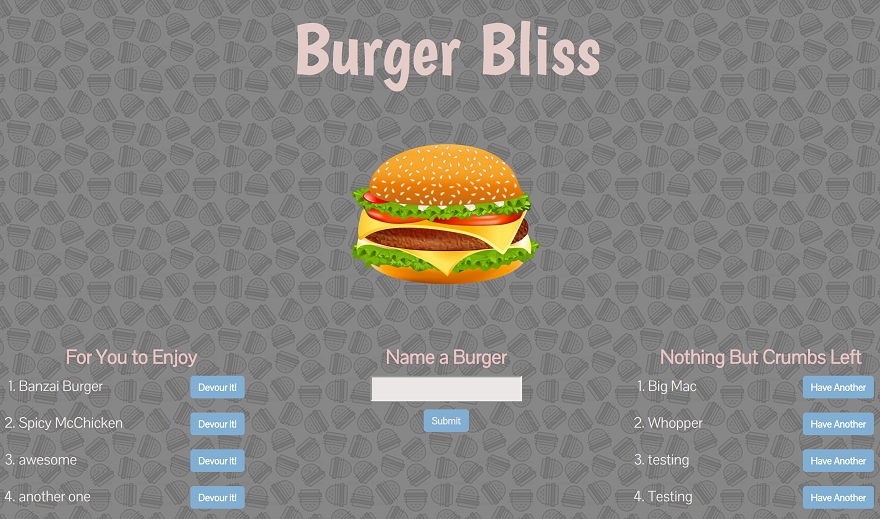

# burger
A user interactive burger application that servers mysql requests to add,  update and display data from the database. sSimply enter the name your favorite burger, select to devour it, then review all of the burgers that you have devoured.

### About this app
Single page node express app using mysql and handlebars to serve html. This application exhibits how handlebars and mySQL process requests work within a MVC model.

This applicantion is deployed to Heroku at the following site: https://burger-bliss.herokuapp.com/

### To Install
To install this application, clone the repo onto your computer. As this is a node based application with sever package dependencies, you will need to download several packages. To do this you must open your command line and navigate the the folder, burger. Type in the command "npm install". This will prompt several installations of all of the required dependencies. Once all dependencies are installed, turn on the server by running the command "node server.js", then finally navigate to the localhost:3000 on your web browser.

### Screenshot of Application
